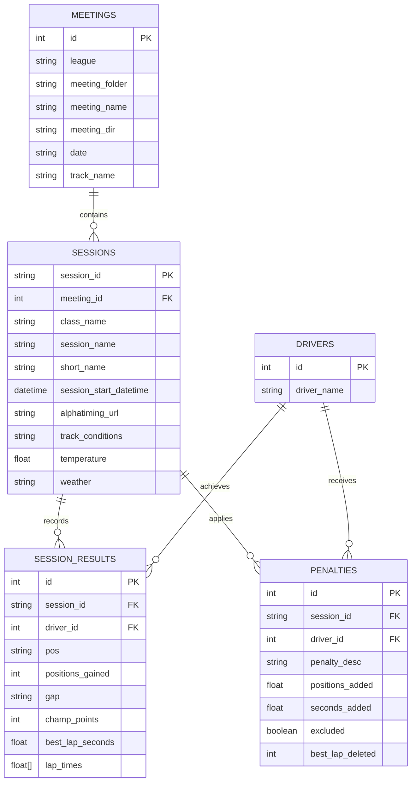

# RaceDB Relational Database Migration & Indexing Strategy

This report analyzes the current in-memory, file-system-based architecture of the `RaceDB` class in `race_db.py`, identifies high-priority performance bottlenecks in the Flask web app, and provides a comprehensive blueprint to migrate to an indexed SQL database (e.g., SQLite).

---

## 1. Current Architecture & Performance Bottlenecks

Currently, `RaceDB` walks the entire data directory at startup, parsing JSON and CSV files on demand, and loads them into memory as large pandas DataFrames. As the volume of race sessions and lap times grows, this architecture suffers from severe scalability bottlenecks.

### 🚩 Key Bottlenecks Identified

1. **Initialization Walk Cost (`database.py` / `race_db.py`)**:
   - At startup or whenever `from database import db` is called, `RaceDB.__init__` triggers `_walk_and_cache()`, which recursively searches and opens every single `*_metadata.json` file in the filesystem.
   - This prevents fast startups, slows down unit tests, and adds significant disk I/O overhead.

2. **The "Load All History" Antipattern (`app.py:833`)**:
   - **Drivers List page (`/drivers`)** calls `db.load()` with **no arguments**, which forces pandas to load and parse *every lap time of every driver in history*, solely to call `df['Name'].unique()`.
   - **Driver Profile page (`/driver/<name>`)** also calls `db.load()` with **no arguments** to find the sessions where the driver participated, group them, and compute progression metrics.
   - For a real-world database of several thousand laps, this can cause the server to freeze or crash due to out-of-memory (OOM) errors.

3. **In-Memory Melting & String Parsing**:
   - Lap times are stored in CSV columns (`Lap 1`, `Lap 2`, etc.). Currently, `_load_cached` has to load the wide-format CSV, filter out invalid rows, "melt" it to long format, and apply regex/string cleaning (`sanitize.parse_time`) to every single lap cell *on every load request*.
   - Although `lru_cache(maxsize=16)` is used, any cache miss triggers this heavy I/O and CPU pipeline.

4. **KartSim Class Directory Scanning (`app.py:353` / `app.py:367`)**:
   - In `class_view`, to determine which years contain sessions for the "hero driver," the app calls:
     ```python
     df_hero_all = db.load(leagues=league, classes=class_name, driver_names=tuple(hero_names))
     ```
     This melts and parses massive amounts of lap telemetry only to extract unique years.

---

## 2. Proposed Relational DB Schema

Moving the catalog metadata and lap times to a relational DB (such as PostgreSQL or an embedded SQLite database with JSON support) allows us to store pre-melted, pre-parsed lap times in a highly optimized format and leverage powerful querying capabilities. Telemetry files (GPS, sector lines) will remain as files in the filesystem.

Below is the designed schema:



### SQL Table Schema Definitions (PostgreSQL Dialect)

```sql
-- Meetings catalog (track_name located at event level)
CREATE TABLE meetings (
    id SERIAL PRIMARY KEY,
    league TEXT NOT NULL,
    meeting_folder TEXT NOT NULL,
    meeting_name TEXT NOT NULL,
    meeting_dir TEXT NOT NULL,
    date DATE NOT NULL,
    track_name TEXT NOT NULL
);

-- Drivers registry
CREATE TABLE drivers (
    id SERIAL PRIMARY KEY,
    driver_name TEXT UNIQUE NOT NULL
);

-- Sessions metadata
CREATE TABLE sessions (
    session_id TEXT PRIMARY KEY,
    meeting_id INTEGER NOT NULL REFERENCES meetings (id) ON DELETE CASCADE,
    class_name TEXT NOT NULL,
    session_name TEXT NOT NULL,
    short_name TEXT NOT NULL,
    session_start_datetime TIMESTAMP WITHOUT TIME ZONE NOT NULL,
    alphatiming_url TEXT,
    track_conditions TEXT,
    temperature REAL, -- Celsius float (e.g. 18.5)
    weather TEXT
);

-- Session-wide final outcomes and laptimes array
CREATE TABLE session_results (
    id SERIAL PRIMARY KEY,
    session_id TEXT NOT NULL REFERENCES sessions (session_id) ON DELETE CASCADE,
    driver_id INTEGER NOT NULL REFERENCES drivers (id) ON DELETE CASCADE,
    pos TEXT, -- Preserves 'DNS', 'DNF', 'DSQ', or numeric positions
    positions_gained INTEGER DEFAULT 0,
    gap TEXT, -- Gap to winner (e.g. "+5.210s", "+1 Lap")
    champ_points INTEGER,
    best_lap_seconds REAL, -- Pre-computed personal best in session (indexed for MIN lookups)
    lap_times REAL[], -- Array of lap times in seconds. NULL indicates a deleted/invalid lap.
    CONSTRAINT unique_driver_session UNIQUE (session_id, driver_id)
);

-- Session penalties
CREATE TABLE penalties (
    id SERIAL PRIMARY KEY,
    session_id TEXT NOT NULL REFERENCES sessions (session_id) ON DELETE CASCADE,
    driver_id INTEGER NOT NULL REFERENCES drivers (id) ON DELETE CASCADE,
    penalty_desc TEXT,
    positions_added REAL DEFAULT 0.0,
    seconds_added REAL DEFAULT 0.0,
    excluded BOOLEAN DEFAULT FALSE,
    best_lap_deleted BOOLEAN DEFAULT FALSE
);
```

---

## 3. Targeted Database Indexes & Optimizations

Leveraging native arrays and dedicated session-wide results dramatically reduces our index footprint while maximizing performance.

### ⚡ Critical Indexes to Benefit Code Paths

| Target Table | Index Name | Columns Indexed | Benefiting Route/Code Path |
| :--- | :--- | :--- | :--- |
| **`session_results`** | `idx_results_driver` | `(driver_id, session_id)` | **Driver Profile (`/driver/<name>`)** & **Drivers List (`/drivers`)**. Bypasses massive table scans, returning a driver's historical sessions in microseconds. |
| **`session_results`** | `idx_results_session` | `(session_id, best_lap_seconds)` | **Violin/Gap/Combined Plot Generators**. Loads a session's leaderboard in sorted order immediately. |
| **`meetings`** | `idx_meetings_lookup` | `(league, date, track_name)` | **Track/League Views**. Optimizes filtering schedules by league and track. |
| **`sessions`** | `idx_sessions_start` | `(session_start_datetime)` | **Main Page event catalog and chronological sorting**. |
| **`drivers`** | `idx_drivers_name` | `(driver_name)` | **Autocomplete & Driver Search**. |

---

## 4. Refactoring `RaceDB` Interface: Narrow-Scoped Methods

Exposing narrow, intent-driven query methods keeps memory footprints minimal and shifts calculations to the database engine.

Here is a summary of the recommended interface upgrades:

### 1. Drivers Directory Page (`/drivers`)
* **Old Way**: Loads all lap times ($>100\text{k}$ rows) $\rightarrow$ `df['Name'].unique()`
* **New DB Method**: `db.get_driver_names() -> list[str]`
* **SQL Query**:
  ```sql
  SELECT driver_name FROM drivers ORDER BY driver_name;
  ```

### 2. Driver Profile Page (`/driver/<name>`)
* **Old Way**: Loads all lap times $\rightarrow$ Filters in pandas $\rightarrow$ Aggregates `groupby` on memory.
* **New DB Method**: `db.get_driver_personal_bests(driver_name: str) -> pd.DataFrame`
* **SQL Query**:
  ```sql
  SELECT 
      m.league AS League, 
      m.track_name AS TrackName, 
      s.session_start_datetime AS Date, 
      s.class_name AS Class, 
      r.best_lap_seconds AS LapTimeSeconds, 
      r.session_id AS SessionID
  FROM session_results r
  JOIN sessions s ON r.session_id = s.session_id
  JOIN meetings m ON s.meeting_id = m.id
  JOIN drivers d ON r.driver_id = d.id
  WHERE d.driver_name = ? AND r.best_lap_seconds IS NOT NULL;
  ```
  *(Backed by `idx_results_driver`, this runs in **$<2\text{ms}$**)*.

### 3. Driver Progression Calculations
To plot chronological lap time progression relative to the session leader (which currently requires loading the entire session's laptimes to identify `min_best` for each event):
* **New DB Method**: `db.get_driver_session_progression(driver_name: str) -> pd.DataFrame`
* **SQL Query**:
  ```sql
  WITH session_bests AS (
      SELECT session_id, MIN(best_lap_seconds) AS leader_best
      FROM session_results
      WHERE best_lap_seconds IS NOT NULL
      GROUP BY session_id
  ),
  session_participants AS (
      SELECT session_id, COUNT(driver_id) AS participants
      FROM session_results
      GROUP BY session_id
  )
  SELECT 
      m.league AS League,
      s.class_name AS Class,
      s.session_start_datetime AS DateTime,
      s.session_name AS SessionName,
      m.track_name AS TrackName,
      s.track_conditions AS TrackConditions,
      r.pos AS Pos,
      r.gap AS Gap,
      r.best_lap_seconds AS LapTimeSeconds,
      sb.leader_best AS LeaderBestTime,
      sp.participants AS Participants,
      r.session_id AS SessionID
  FROM session_results r
  JOIN sessions s ON r.session_id = s.session_id
  JOIN meetings m ON s.meeting_id = m.id
  JOIN drivers d ON r.driver_id = d.id
  JOIN session_bests sb ON r.session_id = sb.session_id
  JOIN session_participants sp ON r.session_id = sp.session_id
  WHERE d.driver_name = ?
  ORDER BY s.session_start_datetime ASC;
  ```

---

## 5. Summary of Main Page Requirements

The landing and league exploration pages (`/`, `/league`, `/league/<league>`, `/league/<league>/<class_name>`) only require session index information, track lists, and schedule records. 

By replacing filesystem directory walks with indexed SQLite scans, the main page will load instantaneously:

* **League Catalog**:
  ```sql
  SELECT DISTINCT league FROM meetings ORDER BY league;
  ```
* **Championship Meetings Filter (by class/year)**:
  ```sql
  SELECT DISTINCT s.class_name, DATE(s.session_start_datetime) AS date, m.track_name
  FROM sessions s
  JOIN meetings m ON s.meeting_id = m.id
  WHERE m.league = ? AND s.session_start_datetime LIKE ?
  ORDER BY date DESC;
  ```

---

## 6. Implementation Action Plan

> [!TIP]
> **Incremental Database Migration Pattern**:
> 1. Keep the existing `RaceDB` interface signatures intact (i.e. keep `load()` but back it with an SQL query that returns a compatible pandas DataFrame).
> 2. Introduce a background ingestion/synchronization task (`db.sync_fs_to_db()`) that walks directories to index files into SQLite, running only when files are updated or via a lightweight hash check.
> 3. Refactor caller paths like `driver_view` and `drivers_list` to utilize the new, narrow-scoped query methods immediately.
